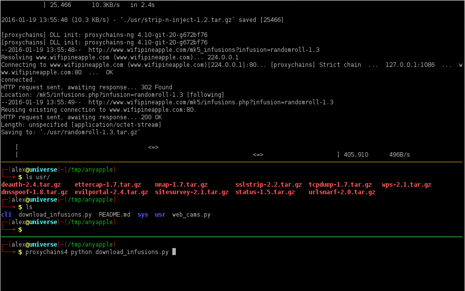

Anyapple
=======================================
By Alexander Liu

[LICENSE: FTE v1](https://github.com/xros/license-FTE-v1)


    Why this?

* I found the resources of [WifiPineapple](https://www.wifipineapple.com) were not so *OPEN*. So I did a bit hack into it.
And everyone can build his or her own WifiPineapple System.
I bought a cheap portable router which is only $20, **Lenovo PWR G-60**, which has Atheros 9331 with 64MB RAM, 16MB ROM, SD socket, USB 2.0 socket,  6000 MHA Lipo bettery built inside. Battery life can be upto 14 hours.
And I hacked it a bit with a better antenna.
All your need is a compatible router which can run OpenWRT.


WifiPineapple Mark 5 Infusion downloader
=======================================
* It was included.


Requiresments
-------------
* A Linux/Unix system that has installed *python, curl, wget*
* Good internet connection -- In some region, internet was almost down. So you would need proxies, such as *shadowsocks* or *proxychains* and etc..


Download all infusions
----------------------
* Usage as followings:

    

    It will take some time ...

    ```bash
    python download_infusions.py
    # Or use a proxy
    proxychains4 python download_infusions.py
    ```

### Use proxy if Internet is censord

Connect to your router via SSH protocol. WifiPineapple is based on OpenWRT.

This will create serveral folders, such as *./downloads/usr* , *./downloads/sys* , *./downloads/cli* and etc. and download them all into folders.

Try to update your system if the ISP blocks the Interent.

    export HTTP_PROXY="127.0.0.1:1080"
    export HTTPS_PROXY="127.0.0.1:1080"

### Extract to wifipineapple
Copy all the downloads to /pineapple/components/ . I would recommend you copy files to the SD card */sd/[your_folder]* on wifipineapple. And you can create soft links to the path on SD card.

After getting into wifipinapple, for example,  do 

    cd /sd/[your_folder]/usr
    ln -sf /sd/[your_folder]/usr /pineapple/components/
    for i in `ls | grep .tar.gz | xargs`; do tar -xzvf $i -C ./ ; done

Removing all infusion packages _*.tar.gz_

    cd /pineapple/components/usr/
    rm ./*.tar.gz -rf


### Use web UI

You would see this if infusions are installed in this way. Then try to install some dependencis.

It would be slow if you install all of them. Try to select some of them you need.


#### Happy hacking!
